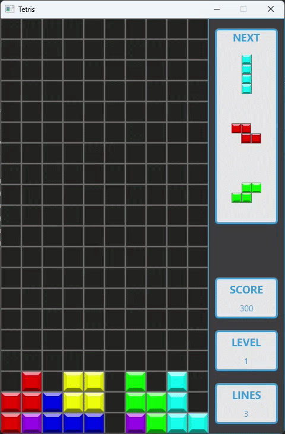

A simple clone of the classic Tetris game, built using Java and JavaFX. 
This project demonstrates adherence to clean software architecture, OOP principles, and Gang of Four (GoF) 
design patterns. It features custom game loop mechanics, advanced matrix mutations, and decoupled user interfaces.

Made over the course of about 2 weeks as a challenge to myself immediately following the 
completion of [Minesweeper](https://github.com/ZihengL/Minesweeper), which, to my own surprise, 
had taken me much less time than I'd anticipated.

## 🛠️ Tech Stack

* **Language:** Java 21
* **UI Framework:** JavaFX
* **Build Tool:** Apache Maven
* **Core Concepts:** MVC Architecture, Command Pattern, Observer Pattern, Vector Mathematics.

## 🚀 Key Architectural Features

* **Frame-Independent Game Loop:** 
Engineered a custom 60-tick game loop using JavaFX Timeline to manage continuous state progression, 
integrating a threshold-based frame counter to dynamically scale gravity across levels.

* **Decoupled Input Handling:** 
Utilized the Command pattern and functional callbacks to map keyboard events directly to game logic, 
fully decoupling JavaFX input listeners from the core simulation.

* **Functional UI Synchronization:** 
Streamlined presentation layer updates by injecting functional interfaces into JavaFX components, 
allowing autonomous UI updates without tight coupling to the data model.

* **Advanced Matrix Mutation:** 
Developed a dynamic grid mutation system using custom 'syphon' and 'transmit' operations to isolate the active 
piece from the static matrix during spatial validations.

* **Mathematical Rotation Engine:** 
Built a highly precise rotation engine powered by Cartesian coordinates and vector mathematics, 
implementing a variant of the Super Rotation System (SRS) using vector translation tables to resolve collision scenarios.

* **Algorithmic Fairness:** 
Implemented a 7-bag randomized generation algorithm to ensure fair piece 
distribution and maintain predictable upcoming game states.

## 🎮 Controls

* **Left Arrow:** Shift left
* **Right Arrow:** Shift right
* **Down Arrow:** Soft drop
* **Up Arrow:** Rotate right
* **X:** Rotate right
* **Z:** Rotate left
* **Space:** Hard drop

## ⚙️ How to Run (Pre-compiled Release)

> **IMPORTANT**: You must have **Java 21** (or higher) installed on your machine to run this application.
> [**The latest version of Java Temurin can be found here.**](https://adoptium.net/temurin/releases)

1. Navigate to the [Releases](../../releases) page of this repository.
2. Download the latest `Tetris-v1.0.jar` file.
3. Open and enjoy!